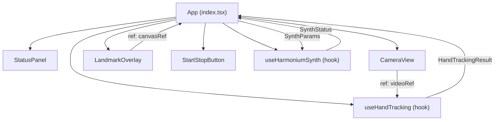
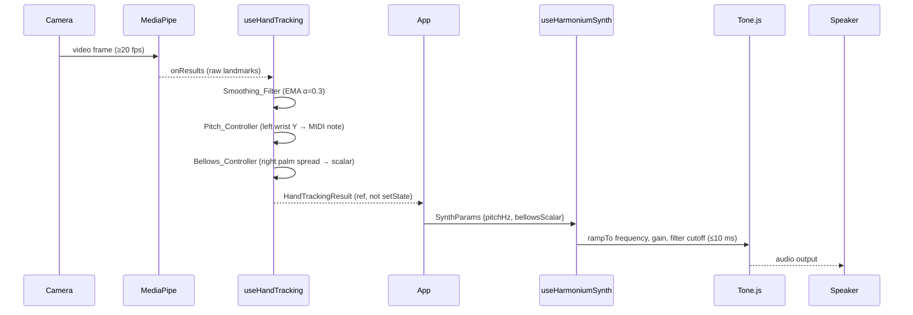
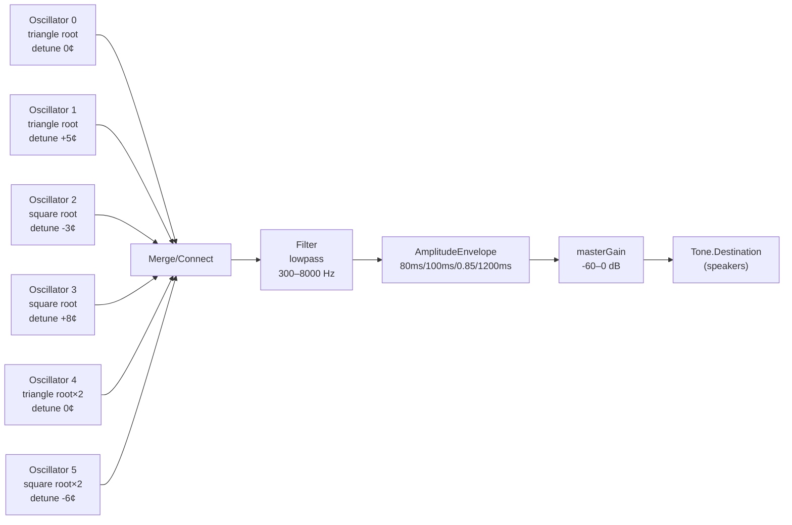

# Design Document — Gesture Harmonium

## Overview

The Gesture Harmonium is a browser-based musical instrument that converts hand movements into harmonium-like audio in real time. Two hands serve distinct roles: the left hand governs pitch by mapping wrist vertical position to a chromatic two-octave note grid; the right hand governs expression by mapping palm spread to master volume and LPF cutoff on a logarithmic curve, mimicking physical bellows pressure.

The application is a React single-page application written in TypeScript, bundled by Vite, styled with Tailwind CSS. The audio engine is built on Tone.js and the hand-tracking pipeline runs on Google MediaPipe Hands (`@mediapipe/hands` + `@mediapipe/camera_utils`). All camera, tracking, and audio lifecycle concerns are isolated in two custom hooks (`useHandTracking` and `useHarmoniumSynth`) so that the React component tree is purely presentational.

**Key design constraints:**

- End-to-end gesture-to-audio latency ≤ 100 ms (Requirement 12.1).
- Audio context must not start until a user gesture to satisfy browser autoplay policy (Requirement 4.1).
- Coordinate smoothing (EMA α = 0.3) must happen before pitch/bellows controllers consume data (Requirement 11).
- All data contracts between the hooks are typed and serialisable (Requirement 14).

---

## Architecture

### React Component Tree



**Component responsibilities:**

| Component | Responsibility |
|---|---|
| `App` | Owns all state; wires hooks to presentational components; implements start/stop logic |
| `CameraView` | Renders the mirrored `<video>` element; forwards `videoRef` to the hand-tracking hook |
| `LandmarkOverlay` | Renders a `<canvas>` absolutely positioned over `CameraView`; draws skeletons via `requestAnimationFrame` |
| `StatusPanel` | Reads three boolean/error status flags and renders colour-coded indicators |
| `StartStopButton` | Shows "Start Harmonium" or "Stop" based on `appState`; disabled during transitioning |

### High-Level Data Flow



> The `HandTrackingResult` is stored in a `useRef` rather than `useState` inside `App` to avoid React re-renders on every frame (60 fps would overwhelm React's reconciler). A `useEffect` tick at ~60 fps reads the ref and pushes `SynthParams` to the synth hook.

---

## Components and Interfaces

### `App` — `src/App.tsx`

Owns the following state:

```typescript
type AppState = "idle" | "starting" | "running" | "stopping";

interface AppStatus {
  appState: AppState;
  cameraActive: boolean;
  handsDetected: boolean;
  audioActive: boolean;
  errorMessage: string | null;
}
```

The `App` component:
1. On "Start Harmonium" click: calls `startAll()` which sequentially initialises synth → camera → hand tracker (Requirement 10.2).
2. On "Stop" click: calls `stopAll()` which stops tracker → releases camera → suspends audio context (Requirement 10.4).
3. Drives a `requestAnimationFrame` loop that reads the latest `HandTrackingResult` from the hook ref, computes `SynthParams`, and calls the synth hook's `updateParams()`.
4. Passes landmark data down to `LandmarkOverlay` for drawing.

### `CameraView` — `src/components/CameraView.tsx`

```typescript
interface CameraViewProps {
  videoRef: React.RefObject<HTMLVideoElement>;
}
```

Renders:
```tsx
<video
  ref={videoRef}
  autoPlay
  playsInline
  muted
  className="w-full h-full object-cover scale-x-[-1]"  // mirrored
  aria-hidden="true"
/>
```

The `scale-x-[-1]` Tailwind class mirrors the feed horizontally (Requirement 1.2).

### `LandmarkOverlay` — `src/components/LandmarkOverlay.tsx`

```typescript
interface LandmarkOverlayProps {
  canvasRef: React.RefObject<HTMLCanvasElement>;
  videoWidth: number;
  videoHeight: number;
}
```

- Positioned `absolute inset-0` over `CameraView`.
- Has `aria-hidden="true"` (Requirement 13.5).
- Drawing is called from the `App`'s `requestAnimationFrame` loop, not from inside `onResults`, to avoid blocking the MediaPipe pipeline (Requirement 12.5).
- Left-hand landmarks: `#4ADE80` (green-400); right-hand landmarks: `#60A5FA` (blue-400). Contrast ratio between these two colours exceeds 3:1 (Requirement 3.3).

### `StatusPanel` — `src/components/StatusPanel.tsx`

```typescript
type IndicatorState = "active" | "inactive" | "error" | "loading";

interface StatusPanelProps {
  camera: IndicatorState;
  hands: IndicatorState;
  audio: IndicatorState;
}
```

Renders three rows. Each indicator maps:
- `active` → green dot (filled circle)
- `inactive` / `loading` → grey dot (unfilled circle)
- `error` → red, alert icon

Updated within 16 ms of state change because it reads directly from React state (Requirement 9.7).

### `StartStopButton` — `src/components/StartStopButton.tsx`

```typescript
interface StartStopButtonProps {
  appState: AppState;
  onStart: () => void;
  onStop: () => void;
}
```

- `aria-label="Start Harmonium"` or `aria-label="Stop the instrument"` (Requirement 13.4).
- Disabled + loading spinner when `appState === "starting" | "stopping"`.

---

## Data Models

### `Landmark3D`

```typescript
interface Landmark3D {
  x: number; // normalised 0.0–1.0 (left to right)
  y: number; // normalised 0.0–1.0 (top to bottom)
  z: number; // depth, positive = away from camera
}
```

### `DetectedHand`

```typescript
type Handedness = "Left" | "Right";

interface DetectedHand {
  handedness: Handedness;
  confidence: number;        // MediaPipe handedness score 0.0–1.0
  landmarks: Landmark3D[];   // exactly 21 elements; validated before publish
}
```

### `HandTrackingResult`

```typescript
interface HandTrackingResult {
  hands: DetectedHand[]; // 0, 1, or 2 entries; never more than 2
  timestamp: number;     // performance.now() at time of detection
}
```

Published by `useHandTracking` after smoothing. Serialises to JSON without loss (Requirement 14.2). Invalid structures (≠ 21 landmarks, > 2 hands, invalid handedness) are rejected before publishing (Requirements 14.6, 14.7).

### `SynthParams`

```typescript
type EnvelopeState = "attack" | "sustain" | "release";

interface SynthParams {
  pitchHz: number;        // clamped to [20, 2000] — maps to Synth_Engine frequency
  bellowsScalar: number;  // clamped to [0.0, 1.0] — maps to gain + LPF
  envelopeState: EnvelopeState;
}
```

Out-of-range values are clamped, never thrown (Requirement 14.4). Valid `HandTrackingResult` always maps to valid `SynthParams` in range (Requirement 14.5).

### `ADSRParams`

```typescript
interface ADSRParams {
  attack: number;   // ms, range [1, 5000], default 80
  decay: number;    // ms, range [1, 5000], default 100
  sustain: number;  // 0.0–1.0, default 0.85
  release: number;  // ms, range [1, 10000], default 1200
}
```

Bounds enforced by `useHarmoniumSynth.setEnvelopeParams()` (Requirement 8.5, 8.6).

### `SmoothedState` (internal to `useHandTracking`)

```typescript
interface SmoothedState {
  leftWrist: Landmark3D | null;
  rightThumbTip: Landmark3D | null;
  rightPinkyTip: Landmark3D | null;
  prevSmoothed: {
    leftWristY: number;
    palmSpread: number;
  };
}
```

Smoothing is per-coordinate using `smoothed = alpha * raw + (1 - alpha) * prev` (Requirement 11.3). On first detection or re-detection, `prev` is seeded with the first raw value (Requirements 11.4, 11.7).

---

## Hook Architecture

### `useHandTracking` — `src/hooks/useHandTracking.ts`

**Responsibilities:** MediaPipe initialisation, frame processing, smoothing, pitch quantisation, bellows computation, status reporting.

```typescript
interface UseHandTrackingOptions {
  videoRef: React.RefObject<HTMLVideoElement>;
  smoothingAlpha?: number; // default 0.3
}

interface UseHandTrackingReturn {
  resultRef: React.MutableRefObject<HandTrackingResult>;
  status: "idle" | "initialising" | "running" | "error";
  errorMessage: string | null;
  start: () => Promise<void>;
  stop: () => void;
  setSmoothingAlpha: (alpha: number) => void; // Requirement 11.5
}

function useHandTracking(options: UseHandTrackingOptions): UseHandTrackingReturn
```

**Internal lifecycle:**

```
start()
  └── new Hands({ locateFile })
        ├── setOptions({ maxNumHands: 2, modelComplexity: 1, ... })
        ├── onResults(handleResults)
        └── new Camera(videoRef.current, { onFrame, width: 640, height: 480 })
              └── camera.start()

handleResults(results)
  ├── validate: keep top-2 by confidence, reject invalid structures
  ├── apply EMA smoothing to wristY and palmSpread
  ├── run Pitch_Controller → MIDI note → Hz
  ├── run Bellows_Controller → bellowsScalar
  └── write to resultRef.current (no setState — avoids re-render)

stop()
  ├── camera.stop()
  └── hands.close()
```

**Pitch_Controller logic** (Requirement 6.6):
```
midiNote = clamp(72 - Math.round(normalisedY * 24), 48, 72)
pitchHz  = 440 * Math.pow(2, (midiNote - 69) / 12)
```

**Bellows_Controller logic** (Requirements 7.1–7.8):
```
rawSpread    = euclidean(thumbTip, pinkyTip)          // in normalised coords
bellowsScalar = clamp(rawSpread / 0.4, 0.0, 1.0)
gainDb       = bellowsScalar === 0 ? -60 : -60 + 60 * bellowsScalar   // log mapped
lpfHz        = 300 * Math.pow(8000/300, bellowsScalar)                 // log: 300→8000 Hz
```

**Frame timeout guard** (Requirement 2.8): If `onFrame` takes > 50 ms, the frame is discarded and `resultRef` is not updated for that frame.

### `useHarmoniumSynth` — `src/hooks/useHarmoniumSynth.ts`

**Responsibilities:** Tone.js graph construction, parameter modulation, ADSR envelope management, lifecycle (start/stop/dispose).

```typescript
interface UseHarmoniumSynthReturn {
  status: "idle" | "initialising" | "running" | "error";
  errorMessage: string | null;
  start: () => Promise<void>;   // resumes AudioContext
  stop: () => Promise<void>;    // suspends + disposes
  updateParams: (params: SynthParams) => void;  // called every rAF tick
  setEnvelopeParams: (params: Partial<ADSRParams>) => void | Error;
}

function useHarmoniumSynth(): UseHarmoniumSynthReturn
```

**Signal chain** (Requirement 4.5):
```
Reed_Oscillator_Bank
  ├── osc[0]: triangle, root,        detune  0 cents
  ├── osc[1]: triangle, root,        detune +5 cents
  ├── osc[2]: square,   root,        detune -3 cents
  ├── osc[3]: square,   root,        detune +8 cents
  ├── osc[4]: triangle, root × 2,   detune  0 cents   (octave stop, Req 5.4)
  └── osc[5]: square,   root × 2,   detune -6 cents
        │
        ▼
      LPF (Filter, type: "lowpass")
        │
        ▼
      AmplitudeEnvelope (ADSR: 80/100/0.85/1200)
        │
        ▼
      masterGain (Gain node)
        │
        ▼
      Tone.getDestination()
```

**Design decisions:**

- Six oscillators meet the 4–8 voice requirement (Requirement 5.1) with triangle+square mix (Requirement 5.2).
- Detunes: `[0, +5, -3, +8, 0, -6]` cents — all pairs separated ≥ 1 cent (Requirement 5.3), all within ±8 cents (Requirement 5.3).
- Frequency updates use `oscillator.frequency.rampTo(newHz, 0.01)` — 10 ms linear ramp (Requirement 5.5, 6.4).
- Gain uses `masterGain.gain.rampTo(linearFromDb, 0.005)` (≤ 5.8 ms, Requirement 7.5).
- LPF uses `filter.frequency.rampTo(newHz, 0.005)` (Requirement 7.5).
- Voices outside [27.5, 4186] Hz are silenced by setting gain to 0 (Requirement 5.7).
- On first start, envelope enters sustain at 0.85 immediately (Requirement 8.2).
- ADSR `setEnvelopeParams` validates bounds; returns `Error` on violation, retains previous value (Requirement 8.6).

---

## Tone.js Signal Flow Detail



**Parameter ramping table:**

| Parameter | Trigger | Method | Duration |
|---|---|---|---|
| Oscillator frequency | Left-hand Y changes note | `osc.frequency.rampTo(hz, 0.01)` | 10 ms |
| LPF cutoff | Bellows scalar changes | `filter.frequency.rampTo(hz, 0.005)` | 5 ms |
| Master gain | Bellows scalar changes | `masterGain.gain.rampTo(linear, 0.005)` | 5 ms |
| Envelope attack | Left hand re-detected | `envelope.triggerAttack()` | 80 ms to sustain |
| Envelope release | Left hand absent > 500 ms | `envelope.triggerRelease()` | 1200 ms |

**dB-to-linear conversion** used for master gain:
```typescript
// bellowsScalar 0.0 → -60 dB → linear ≈ 0.001
// bellowsScalar 1.0 →   0 dB → linear = 1.0
const gainDb = -60 + bellowsScalar * 60;
const gainLinear = Math.pow(10, gainDb / 20);
masterGain.gain.rampTo(gainLinear, 0.005);
```

**LPF logarithmic mapping:**
```typescript
// 300 Hz at scalar 0.0, 8000 Hz at scalar 1.0
const lpfHz = 300 * Math.pow(8000 / 300, bellowsScalar);
filter.frequency.rampTo(lpfHz, 0.005);
```

---

## Hand-to-Audio Coordinate Mapping

### Pitch Mapping (Left Hand → Note Grid)

```
Camera frame Y axis (normalised):
  0.0 ─── top of frame    → MIDI 72 (C5, 523.3 Hz)
  │
  │   Each 1/24 strip = one semitone
  │
  1.0 ─── bottom of frame → MIDI 48 (C3, 130.8 Hz)

Formula: midiNote = clamp(72 - round(normY × 24), 48, 72)
         pitchHz  = 440 × 2^((midiNote - 69) / 12)
```

The 25 MIDI notes (48–72) are mapped onto 24 equal vertical regions. The boundary between note N and note N+1 falls at normY = (72 - N - 0.5) / 24.

| normY range | MIDI note | Frequency |
|---|---|---|
| 0.000 – 0.021 | 72 (C5) | 523.3 Hz |
| 0.021 – 0.063 | 71 (B4) | 493.9 Hz |
| 0.063 – 0.104 | 70 (A#4) | 466.2 Hz |
| ... | ... | ... |
| 0.958 – 1.000 | 48 (C3) | 130.8 Hz |

### Bellows Mapping (Right Hand → Volume + Brightness)

```
Palm spread = Euclidean distance between landmark[4] (thumb tip)
              and landmark[20] (pinky tip) in normalised coords

bellowsScalar = clamp(palmSpread / 0.4, 0.0, 1.0)

Master gain:  gainDb = -60 + scalar × 60   (logarithmic -60 dB → 0 dB)
LPF cutoff:   lpfHz  = 300 × (8000/300)^scalar  (log sweep 300 Hz → 8 kHz)
```

A closed fist (scalar ≈ 0.0) produces near-silence through a muffled filter. A fully spread hand (scalar ≈ 1.0) produces full volume with a bright, open timbre, matching harmonium bellows behaviour.

### Smoothing Filter

EMA formula applied per coordinate per frame (Requirement 11.3):
```
smoothed_t = α × raw_t + (1 − α) × smoothed_{t-1}
```
- Default α = 0.3 (configurable 0.1 – 1.0, Requirement 11.5).
- Applied to: `leftWrist.y`, `rightThumbTip.{x,y}`, `rightPinkyTip.{x,y}`.
- Cold-start and re-detection: `smoothed_0 = raw_0` (Requirements 11.4, 11.7).
- Must complete within 5 ms of receiving coordinates (Requirement 11.6).

---

## Code Skeletons

### `src/main.tsx`

```tsx
import React from "react";
import ReactDOM from "react-dom/client";
import App from "./App";
import "./index.css";

ReactDOM.createRoot(document.getElementById("root")!).render(
  <React.StrictMode>
    <App />
  </React.StrictMode>
);
```

### `src/App.tsx`

```tsx
import React, { useCallback, useEffect, useRef, useState } from "react";
import { useHandTracking } from "./hooks/useHandTracking";
import { useHarmoniumSynth } from "./hooks/useHarmoniumSynth";
import CameraView from "./components/CameraView";
import LandmarkOverlay from "./components/LandmarkOverlay";
import StatusPanel from "./components/StatusPanel";
import StartStopButton from "./components/StartStopButton";
import type { SynthParams } from "./types";

type AppState = "idle" | "starting" | "running" | "stopping";

export default function App() {
  const [appState, setAppState] = useState<AppState>("idle");
  const [errorMessage, setErrorMessage] = useState<string | null>(null);

  const videoRef = useRef<HTMLVideoElement>(null);
  const canvasRef = useRef<HTMLCanvasElement>(null);
  const rafRef = useRef<number>(0);

  const handTracking = useHandTracking({ videoRef });
  const synth = useHarmoniumSynth();

  // rAF loop: read hand results → compute SynthParams → push to synth
  const tick = useCallback(() => {
    const result = handTracking.resultRef.current;
    if (result) {
      // TODO: derive SynthParams from result (see pitchController / bellowsController utils)
      const params: SynthParams = deriveSynthParams(result);
      synth.updateParams(params);
      // TODO: draw landmarks on canvasRef
    }
    rafRef.current = requestAnimationFrame(tick);
  }, [handTracking.resultRef, synth]);

  const startAll = useCallback(async () => {
    setAppState("starting");
    try {
      await synth.start();
      await handTracking.start();
      setAppState("running");
      rafRef.current = requestAnimationFrame(tick);
    } catch (err) {
      setErrorMessage(err instanceof Error ? err.message : String(err));
      setAppState("idle");
    }
  }, [synth, handTracking, tick]);

  const stopAll = useCallback(async () => {
    setAppState("stopping");
    cancelAnimationFrame(rafRef.current);
    handTracking.stop();
    await synth.stop();
    setAppState("idle");
  }, [synth, handTracking]);

  useEffect(() => () => cancelAnimationFrame(rafRef.current), []);

  return (
    <div className="relative w-screen h-screen bg-black flex flex-col items-center justify-center">
      <div className="relative w-full max-w-3xl aspect-video">
        <CameraView videoRef={videoRef} />
        <LandmarkOverlay canvasRef={canvasRef} videoWidth={640} videoHeight={480} />
      </div>
      <StatusPanel
        camera={mapStatus(handTracking.status, appState)}
        hands={handTracking.resultRef.current?.hands.length ? "active" : "inactive"}
        audio={mapStatus(synth.status, appState)}
      />
      <StartStopButton appState={appState} onStart={startAll} onStop={stopAll} />
      {errorMessage && (
        <p role="alert" className="text-red-400 mt-2 text-sm">{errorMessage}</p>
      )}
    </div>
  );
}

// Placeholder — implemented in src/utils/controllers.ts
function deriveSynthParams(_result: unknown): SynthParams {
  return { pitchHz: 261.63, bellowsScalar: 0.5, envelopeState: "sustain" };
}

function mapStatus(hookStatus: string, appState: AppState) {
  if (appState === "starting") return "loading" as const;
  if (hookStatus === "running") return "active" as const;
  if (hookStatus === "error") return "error" as const;
  return "inactive" as const;
}
```

### `src/hooks/useHandTracking.ts`

```typescript
import { useCallback, useEffect, useRef, useState } from "react";
import type { Hands, Results } from "@mediapipe/hands";
import type { Camera } from "@mediapipe/camera_utils";
import type { HandTrackingResult, SmoothedState } from "../types";

interface UseHandTrackingOptions {
  videoRef: React.RefObject<HTMLVideoElement>;
  smoothingAlpha?: number;
}

type TrackingStatus = "idle" | "initialising" | "running" | "error";

export function useHandTracking({ videoRef, smoothingAlpha = 0.3 }: UseHandTrackingOptions) {
  const [status, setStatus] = useState<TrackingStatus>("idle");
  const [errorMessage, setErrorMessage] = useState<string | null>(null);

  const resultRef = useRef<HandTrackingResult>({ hands: [], timestamp: 0 });
  const smoothedRef = useRef<SmoothedState>({
    leftWrist: null,
    rightThumbTip: null,
    rightPinkyTip: null,
    prevSmoothed: { leftWristY: 0, palmSpread: 0 },
  });
  const alphaRef = useRef(smoothingAlpha);
  const handsRef = useRef<Hands | null>(null);
  const cameraRef = useRef<Camera | null>(null);

  const handleResults = useCallback((results: Results) => {
    // 1. Validate and cap at 2 hands
    // 2. Apply EMA smoothing to wrist Y and palm spread
    // 3. Run Pitch_Controller and Bellows_Controller
    // 4. Write to resultRef (no setState)
    // TODO: implement full logic per design spec
  }, []);

  const start = useCallback(async () => {
    if (!videoRef.current) throw new Error("Video element not ready");
    setStatus("initialising");

    const { Hands } = await import("@mediapipe/hands");
    const { Camera } = await import("@mediapipe/camera_utils");

    const hands = new Hands({
      locateFile: (file) => `https://cdn.jsdelivr.net/npm/@mediapipe/hands/${file}`,
    });
    hands.setOptions({
      maxNumHands: 2,
      modelComplexity: 1,
      minDetectionConfidence: 0.7,
      minTrackingConfidence: 0.5,
    });
    hands.onResults(handleResults);
    handsRef.current = hands;

    const camera = new Camera(videoRef.current, {
      onFrame: async () => {
        const frameStart = performance.now();
        if (videoRef.current) await hands.send({ image: videoRef.current });
        // Requirement 2.8: discard frame if > 50 ms
        if (performance.now() - frameStart > 50) return;
      },
      width: 640,
      height: 480,
    });
    cameraRef.current = camera;
    await camera.start();
    setStatus("running");
  }, [videoRef, handleResults]);

  const stop = useCallback(() => {
    cameraRef.current?.stop();
    handsRef.current?.close();
    cameraRef.current = null;
    handsRef.current = null;
    setStatus("idle");
  }, []);

  const setSmoothingAlpha = useCallback((alpha: number) => {
    alphaRef.current = Math.min(1.0, Math.max(0.1, alpha));
  }, []);

  useEffect(() => () => stop(), [stop]);

  return { resultRef, status, errorMessage, start, stop, setSmoothingAlpha };
}
```

### `src/hooks/useHarmoniumSynth.ts`

```typescript
import { useCallback, useRef, useState } from "react";
import * as Tone from "tone";
import type { SynthParams, ADSRParams } from "../types";

type SynthStatus = "idle" | "initialising" | "running" | "error";

interface AudioGraph {
  oscillators: Tone.Oscillator[];
  filter: Tone.Filter;
  envelope: Tone.AmplitudeEnvelope;
  masterGain: Tone.Gain;
}

const DETUNES = [0, 5, -3, 8, 0, -6]; // cents per oscillator voice
const OSC_TYPES: OscillatorType[] = ["triangle", "triangle", "square", "square", "triangle", "square"];
const OCTAVE_MULTIPLIERS = [1, 1, 1, 1, 2, 2]; // osc[4] and osc[5] are upper-octave stop

const DEFAULT_ADSR: ADSRParams = { attack: 0.08, decay: 0.1, sustain: 0.85, release: 1.2 };

export function useHarmoniumSynth() {
  const [status, setStatus] = useState<SynthStatus>("idle");
  const [errorMessage, setErrorMessage] = useState<string | null>(null);
  const graphRef = useRef<AudioGraph | null>(null);
  const adsrRef = useRef<ADSRParams>({ ...DEFAULT_ADSR });
  const lastBellowsRef = useRef(0);

  const start = useCallback(async () => {
    setStatus("initialising");
    await Tone.start(); // resumes AudioContext after user gesture
    if (Tone.getContext().state !== "running") {
      setErrorMessage("Audio context failed to reach running state");
      setStatus("error");
      throw new Error("AudioContext not running");
    }

    const masterGain = new Tone.Gain(0.001).toDestination(); // starts at -60 dB
    const envelope = new Tone.AmplitudeEnvelope({
      attack: adsrRef.current.attack,
      decay: adsrRef.current.decay,
      sustain: adsrRef.current.sustain,
      release: adsrRef.current.release,
    }).connect(masterGain);
    const filter = new Tone.Filter(300, "lowpass").connect(envelope);

    const oscillators = DETUNES.map((detune, i) => {
      const osc = new Tone.Oscillator({
        type: OSC_TYPES[i],
        frequency: 261.63, // C4 initial
        detune,
      }).connect(filter);
      osc.start();
      return osc;
    });

    graphRef.current = { oscillators, filter, envelope, masterGain };

    // Requirement 8.2: enter sustain immediately
    envelope.triggerAttack(Tone.now());

    setStatus("running");
  }, []);

  const stop = useCallback(async () => {
    const graph = graphRef.current;
    if (!graph) return;
    graph.envelope.triggerRelease();
    await new Promise((r) => setTimeout(r, 1300)); // wait for release
    graph.oscillators.forEach((o) => o.stop().dispose());
    graph.filter.dispose();
    graph.envelope.dispose();
    graph.masterGain.dispose();
    graphRef.current = null;
    await Tone.getContext().close();
    setStatus("idle");
  }, []);

  const updateParams = useCallback((params: SynthParams) => {
    const graph = graphRef.current;
    if (!graph || status !== "running") return;

    // Clamp inputs (Requirement 14.4)
    const pitchHz = Math.min(2000, Math.max(20, params.pitchHz));
    const bellows = Math.min(1.0, Math.max(0.0, params.bellowsScalar));

    // Update oscillator frequencies with 10 ms ramp (Req 5.5, 6.4)
    graph.oscillators.forEach((osc, i) => {
      const targetHz = pitchHz * OCTAVE_MULTIPLIERS[i];
      if (targetHz < 27.5 || targetHz > 4186) {
        // Req 5.7: silence out-of-range voice
        (osc as unknown as { volume: Tone.Param }).volume.rampTo(-Infinity, 0.01);
      } else {
        osc.frequency.rampTo(targetHz, 0.01);
      }
    });

    // Update gain + LPF only if bellows changed meaningfully (Req 7.5)
    if (Math.abs(bellows - lastBellowsRef.current) >= 0.01) {
      lastBellowsRef.current = bellows;
      const gainLinear = Math.pow(10, (-60 + bellows * 60) / 20);
      graph.masterGain.gain.rampTo(gainLinear, 0.005);
      const lpfHz = 300 * Math.pow(8000 / 300, bellows);
      graph.filter.frequency.rampTo(lpfHz, 0.005);
    }

    // ADSR envelope state (Req 8.3, 8.4)
    if (params.envelopeState === "release") {
      graph.envelope.triggerRelease(Tone.now());
    } else if (params.envelopeState === "attack") {
      graph.envelope.triggerAttack(Tone.now());
    }
  }, [status]);

  const setEnvelopeParams = useCallback((params: Partial<ADSRParams>): void | Error => {
    const bounds = {
      attack: [0.001, 5],
      decay: [0.001, 5],
      sustain: [0, 1],
      release: [0.001, 10],
    } as const;
    for (const [key, [min, max]] of Object.entries(bounds)) {
      const val = params[key as keyof ADSRParams];
      if (val !== undefined && (val < min || val > max)) {
        return new Error(`Parameter "${key}" value ${val} is out of range [${min}, ${max}]`);
      }
    }
    Object.assign(adsrRef.current, params);
    const graph = graphRef.current;
    if (graph) {
      graph.envelope.set({
        attack: adsrRef.current.attack,
        decay: adsrRef.current.decay,
        sustain: adsrRef.current.sustain,
        release: adsrRef.current.release,
      });
    }
  }, []);

  return { status, errorMessage, start, stop, updateParams, setEnvelopeParams };
}
```

### `src/types.ts` (shared contracts)

```typescript
export type Handedness = "Left" | "Right";
export type EnvelopeState = "attack" | "sustain" | "release";

export interface Landmark3D {
  x: number;
  y: number;
  z: number;
}

export interface DetectedHand {
  handedness: Handedness;
  confidence: number;
  landmarks: Landmark3D[]; // exactly 21 elements
}

export interface HandTrackingResult {
  hands: DetectedHand[]; // 0–2 elements
  timestamp: number;
}

export interface SynthParams {
  pitchHz: number;        // [20, 2000]
  bellowsScalar: number;  // [0.0, 1.0]
  envelopeState: EnvelopeState;
}

export interface ADSRParams {
  attack: number;   // seconds [0.001, 5]
  decay: number;    // seconds [0.001, 5]
  sustain: number;  // [0.0, 1.0]
  release: number;  // seconds [0.001, 10]
}

export interface SmoothedState {
  leftWrist: Landmark3D | null;
  rightThumbTip: Landmark3D | null;
  rightPinkyTip: Landmark3D | null;
  prevSmoothed: {
    leftWristY: number;
    palmSpread: number;
  };
}
```

### `src/utils/controllers.ts` (pitch + bellows logic, pure functions)

```typescript
import type { HandTrackingResult, SynthParams } from "../types";

/** Requirement 6.6: quantise normalised Y to MIDI note */
export function normYToMidi(normY: number): number {
  return Math.min(72, Math.max(48, 72 - Math.round(normY * 24)));
}

/** MIDI note number to frequency in Hz */
export function midiToHz(midi: number): number {
  return 440 * Math.pow(2, (midi - 69) / 12);
}

/** Euclidean distance between two 2D points */
export function euclidean2D(ax: number, ay: number, bx: number, by: number): number {
  return Math.sqrt((bx - ax) ** 2 + (by - ay) ** 2);
}

/** Requirement 7.2: normalise palm spread to 0–1 scalar */
export function normalisePalmSpread(raw: number): number {
  return Math.min(1.0, Math.max(0.0, raw / 0.4));
}

/** EMA smoothing — Requirement 11.3 */
export function ema(raw: number, prev: number, alpha: number): number {
  return alpha * raw + (1 - alpha) * prev;
}

/** Derive SynthParams from a HandTrackingResult */
export function deriveSynthParams(result: HandTrackingResult): SynthParams {
  const left = result.hands.find((h) => h.handedness === "Left");
  const right = result.hands.find((h) => h.handedness === "Right");

  let pitchHz = 261.63; // default C4
  let envelopeState: SynthParams["envelopeState"] = "sustain";
  if (left) {
    pitchHz = midiToHz(normYToMidi(left.landmarks[0].y));
  }

  let bellowsScalar = 0.0;
  if (right) {
    const thumb = right.landmarks[4];
    const pinky = right.landmarks[20];
    const raw = euclidean2D(thumb.x, thumb.y, pinky.x, pinky.y);
    bellowsScalar = normalisePalmSpread(raw);
  }

  return { pitchHz, bellowsScalar, envelopeState };
}
```

---

## Error Handling

| Failure scenario | Detection point | Recovery behaviour |
|---|---|---|
| `getUserMedia` permission denied | `useHandTracking.start()` | Sets `status = "error"`, error message surfaced to `App`, no further initialisation (Req 1.3) |
| `getUserMedia` device error | `useHandTracking.start()` | Same as above, message identifies failure type (Req 1.4) |
| MediaPipe WASM load failure | `import("@mediapipe/hands")` | Catches import error; displays whether WASM unsupported or network error (Req 13.2) |
| `AudioContext` not running after `Tone.start()` | `useHarmoniumSynth.start()` | Error message shown, context remains in prior state (Req 4.2) |
| Web Audio API unavailable | `useHarmoniumSynth.start()` | App continues without audio; "Audio Engine Active" shows distinct styling (Req 13.3) |
| Frame processing > 50 ms | `onFrame` callback | Frame discarded, `resultRef` unchanged (Req 2.8) |
| Hand structure invalid (≠21 landmarks, >2 hands, bad handedness) | `handleResults` validation | Structure rejected, not published (Req 14.6, 14.7) |
| ADSR param out of bounds | `setEnvelopeParams` | Returns `Error`, previous value retained (Req 8.6) |
| Subsystem fails to shut down within 5 s on Stop | `stopAll()` timeout guard | Marks subsystem inactive, releases remaining (Req 10.7) |
| Frame rate drops below 15 fps | Performance monitor in rAF loop | Logs warning, reduces `LandmarkOverlay` canvas resolution by 50% (Req 12.4) |

All error messages flow upward to the `App` component and are displayed via the `StatusPanel` error indicator and/or a `role="alert"` paragraph (Req 10.5).

---

## Testing Strategy

### Approach

This feature is well-suited for both unit tests and property-based tests. The coordinate mapping functions (`normYToMidi`, `midiToHz`, `normalisePalmSpread`, `ema`) are pure functions with clearly bounded input/output contracts, making them ideal for property-based testing. The React components and MediaPipe/Tone.js integrations are better covered by example-based unit tests and integration tests.

**Property-based testing library:** [fast-check](https://github.com/dubzzz/fast-check) — the most widely-used PBT library for TypeScript, with rich generators for numbers, objects, and arrays.

Each property test must run a **minimum of 100 iterations** and must include a comment tag referencing its design property:
```typescript
// Feature: gesture-harmonium, Property N: <property text>
```

### Unit Tests

- `CameraView`: renders `<video>` with `scale-x-[-1]` class; forwards ref correctly.
- `StatusPanel`: maps each `IndicatorState` to the correct colour class and icon.
- `StartStopButton`: shows correct label per `AppState`; is disabled during `"starting"`.
- `LandmarkOverlay`: has `aria-hidden="true"`; canvas dimensions match props.
- `useHarmoniumSynth.setEnvelopeParams`: rejects out-of-bounds values with Error; accepts boundary values.
- `useHandTracking` validation: rejects `HandTrackingResult` with ≠ 21 landmarks; rejects > 2 hands; rejects invalid handedness.
- `deriveSynthParams`: returns `bellowsScalar = 0.0` when no right hand is present; returns pitch at C4 when no left hand is present.

### Integration Tests

- Camera initialisation sequence (`startAll`) in a mocked browser environment.
- `Tone.start()` → `AudioContext` state transitions.
- Full rAF loop: `HandTrackingResult` → `deriveSynthParams` → `updateParams` wiring.

### Property-Based Tests (see Correctness Properties section below)

Property tests are implemented for the pure mapping and serialisation functions using `fast-check`. Each test runs 100+ iterations.

---

## Correctness Properties

*A property is a characteristic or behavior that should hold true across all valid executions of a system — essentially, a formal statement about what the system should do. Properties serve as the bridge between human-readable specifications and machine-verifiable correctness guarantees.*

### Property 1: HandTrackingResult serialisation round-trip

*For any* valid `HandTrackingResult` object (0–2 hands, each with exactly 21 landmarks, handedness values of "Left" or "Right", landmark coordinates as numbers), serialising to JSON and deserialising back SHALL produce an object that is structurally equivalent to the original — identical `handedness` values, identical `x`/`y`/`z` values for all 21 landmarks per hand, and identical hand count.

**Validates: Requirements 14.2**

### Property 2: SynthParams clamping preserves valid range

*For any* pair of numbers (`pitchHz`, `bellowsScalar`), including values below, above, or outside [20, 2000] and [0.0, 1.0] respectively, applying the `SynthParams` clamping logic SHALL produce output values where `pitchHz ∈ [20, 2000]` and `bellowsScalar ∈ [0.0, 1.0]`, and SHALL NOT throw an exception.

**Validates: Requirements 14.4**

### Property 3: Full mapping pipeline always produces in-range SynthParams

*For any* valid `HandTrackingResult` object (well-formed hands, landmarks with normalised coordinates in [0.0, 1.0]), passing it through `deriveSynthParams` (Pitch_Controller + Bellows_Controller) SHALL always produce a `SynthParams` object where `pitchHz ∈ [20, 2000]` and `bellowsScalar ∈ [0.0, 1.0]`.

**Validates: Requirements 14.5**

### Property 4: EMA smoothing is a weighted average

*For any* `raw` value, `prev` value, and `alpha ∈ [0.1, 1.0]`, the EMA formula `smoothed = alpha × raw + (1 − alpha) × prev` SHALL produce a result that lies in the interval `[min(raw, prev), max(raw, prev)]` — i.e., the smoothed value is always between the current raw reading and the previous smoothed value, never outside their range.

**Validates: Requirements 11.3**

### Property 5: ADSR out-of-bounds update is rejected with unchanged state

*For any* set of ADSR parameter values where at least one value falls outside its defined bounds (attack/decay outside [0.001, 5] s, sustain outside [0.0, 1.0], release outside [0.001, 10] s), calling `setEnvelopeParams` SHALL return an `Error` object and the previously applied ADSR parameter values SHALL remain unchanged.

**Validates: Requirements 8.6**
